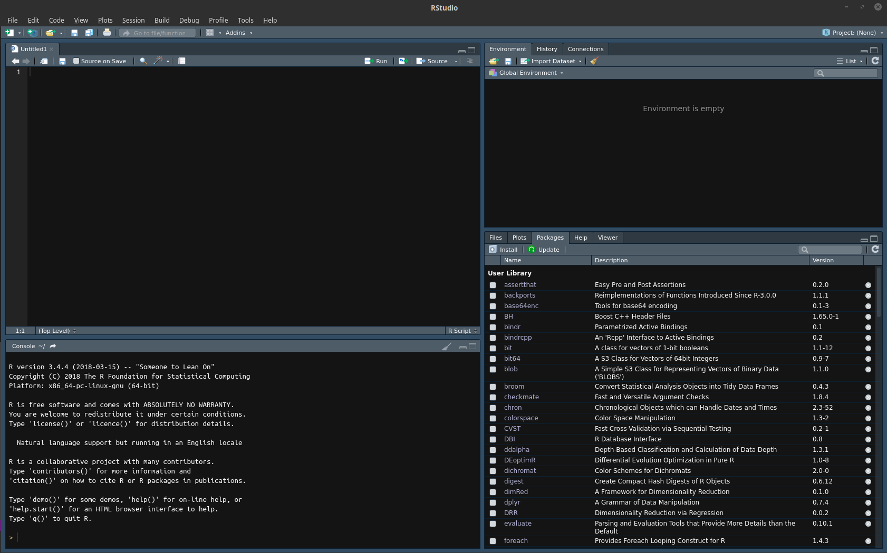
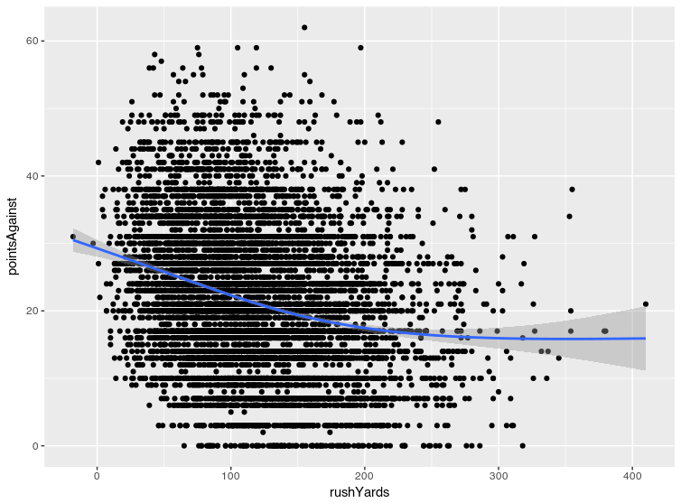

# Using CBA Technology to Analyze Sports Data

## Brown Bag Seminar <br> TERC

---

# Tools for the Day

In this seminar, we will use the following tools:
- R
    - Free, open-source analysis tool
- RStudio
    - Interface to work with code
    - Visualization tool
- SQL
    - Retrieve data    
- SQLectron
    - Great interface to SQL and databases

---

# Data for the Day

Our available NFL Data is a great tool for learning how to work with data.
- Has many tables
- Play-by-play data from 2000-2015
- Actually gets audiences interested! :smile:

---

# A simple question, really...

What are the relationships between offensive and defensive statistics, points scored, and wins in the NFL?

---

# Get the Data from SQLectron


---

# Get the Data from SQLectron


---

# An Important Aside...

There is lots of other data available! We are using sports data for fun, but we have plenty of other great information on the server!

---

# Retrieve Data Using SQL

```SQL
    SELECT
        team.tname AS team,
        game.seas AS season,
        game.wk AS week,
        game.sprv AS spreadAway,
        game.ou AS overUnder,
        CASE
            WHEN game.h=team.tname
                THEN game.ptsh
            ELSE game.ptsv
            END
            AS pointsFor,
        CASE
            WHEN game.h=team.tname
                THEN game.ptsv
            ELSE game.ptsh
            END
            AS pointsAgainst,
        CASE
            WHEN game.h=team.tname AND game.ptsh>game.ptsv
                THEN 1
            WHEN game.v=team.tname AND game.ptsh<game.ptsv
                THEN 1
            WHEN game.ptsv=game.ptsh
                THEN 0.5
            ELSE 0
            END
            AS win,
        CASE
            WHEN game.h=team.tname
                THEN game.v
            ELSE game.h
            END
            AS opponent,
        CASE
            WHEN team.tname=game.h
                THEN 1
            ELSE 0
            END
            AS homeTeam,
        team.ry AS rushYards,
        team.ra AS rushAttempts,
        team.py AS passYards,
        team.pc AS passCompletions,
        team.sk AS sacksAgainst,
        team.top AS timeOfPoss,
        team.pen AS penYardsAgainst,
        team.tdr AS rushTD,
        team.tdp AS passTD
    FROM
        game, team
    WHERE
        game.gid = team.gid
        AND ((game.v = team.tname) OR (game.h = team.tname))
```

---

# Open RStudio!



---

# Getting Started in R

Four Panels:
1. The script editor (top-left)
2. Environment panel (top-right)
3. Console (bottom-left)
4. Package Manager/Viewer (bottom-right)

---

# Getting Started in R

We import our data using a nice, clean, built-in function:

```R
data <- read.csv("/home/dusty/BrownBag - TERC/footballData.csv")
```

Here, we tell `R` to store the data from our query in a variable named `data` (I am a sucker for overly simple names)

---

# Getting Started in R

Let's sure that our data was imported correctly. Use the following command to view the first rows of the imported data:

```R
head(data)
```

---

# Summary statistics

We can create summary statistics tables in R, as well!

```R
summary(data)
```

---

# Tabulating Information

We can cross-tabulate variables to check for basic or obvious relationships

```R
table(data$win, data$homeTeam)
```

In this case, we use the `$` to denote a column within a data frame. So, we are tabulating the number of wins (`data$win`) based on status as the home team (`data$homeTeam`) in a given matchup.

---

# Plotting 101

We first need to import the plotting library that we will use: 

```R
library(ggplot2)
```

`ggplot2` follows a grammar-of-graphics, which makes plotting fairly organic once you get the hang of it

---

# Plotting 101

Let's begin investigating the relationship between points and simple offensive metrics by building our plotting space

```R
ggplot(data, aes(x=rushYards, y=pointsAgainst))
```

---

# Plotting 101

Now we can add points to our plot in order to make it a scatter plot

```R
ggplot(data, aes(x=rushYards, y=pointsAgainst))
    + geom_point()
```

---

# Plotting 101

And then add a trend line!

```R
ggplot(data, aes(x=rushYards, y=pointsAgainst))
    + geom_point()
    + geom_smooth()
```

Pretty easy! RStudio even allows us to quickly save the visual as a static image file.

---



---

# More plots

Passing yards vs points by opposing team

```R
ggplot(data, aes(x=passYards, y=pointsAgainst))
    + geom_point()
    + geom_smooth()
```

---

# More plots

Rushing yards vs probability of winning

```R
ggplot(data, aes(x=rushYards, y=win)) 
    + geom_smooth()
```

---

# More plots

Passing yards vs probability of winning

```R
ggplot(data, aes(x=passYards, y=win)) 
    + geom_smooth()
```

---

# Plotting averages

We will incorporate a new library to create a "summarized" data set

```R
library(dplyr)

means <- data %>%
    group_by(season) %>%
    summarise(rushYards = mean(rushYards),
              passYards = mean(passYards),
              pointsFor = mean(pointsFor))
```

We use this code to measure the mean of three columns broken out by season, and store the data in a data frame called `means`

---

# Plotting averages

Now we can plot the data using almost identical syntax to what was used above! First, rush yards by season:

```R
ggplot(means, aes(x=season, y=rushYards)) 
    + geom_smooth() 
    + geom_point(size=3)
```

---

# Plotting averages

Pass yards by season

```R
ggplot(means, aes(x=season, y=passYards)) 
    + geom_smooth() 
    + geom_point(size=3)
```

---

# Plotting averages

Points scored by season

```R
ggplot(means, aes(x=season, y=pointsFor)) 
    + geom_smooth() 
    + geom_point(size=3)
```

---

# Regression analysis

It's hard to determine what the relationship between winning and offensive statistics are without controlling for other variables that may change between games.

Regression saves the day, and allows us to explore the relationships between statistics and the probability of winning.

---

# Linear Regression - Linear Probability Model

```R
model <- lm(
    win ~ rushYards + passYards + opponent + team 
    + penYardsAgainst + passTD + rushTD + sacksAgainst 
    + timeOfPoss, 

    data=dataWin)
```

---

# Regression results

We can print out a regression table by using the `summary` function. This will work with nearly any regression model in R.

```R
summary(model)
```

---

# Logistic Regression

First, we need to ignore ties (we will just elminate them from our data for now)

```R
dataWin <- subset(data, data$win!=0.5)
```

---

# Logistic Regression

Now, we can use our model to determine the effects of the variables we collected:

```R
model <- glm(
    win ~ rushYards + passYards + opponent + team 
    + penYardsAgainst + passTD + rushTD + sacksAgainst 
    + timeOfPoss, 

    data=dataWin, 
    family="binomial")
```

---

# Logistic Regression

| Dependent variable | Effect    | Dependent variable | Effect    |
|--------------------|-----------|--------------------|-----------|
| rushYards          | 0.003***  | rushTD             | 0.859***  |
| passYards          | -0.008*** | sacksAgainst       | -0.351*** |
| penYardsAgainst    | -0.007*** | timeOfPoss         | 0.230***  |
| passTD             | 0.899***  | Constant           | -5.960*** |

After controlling for the teams playing

---

# Questions?